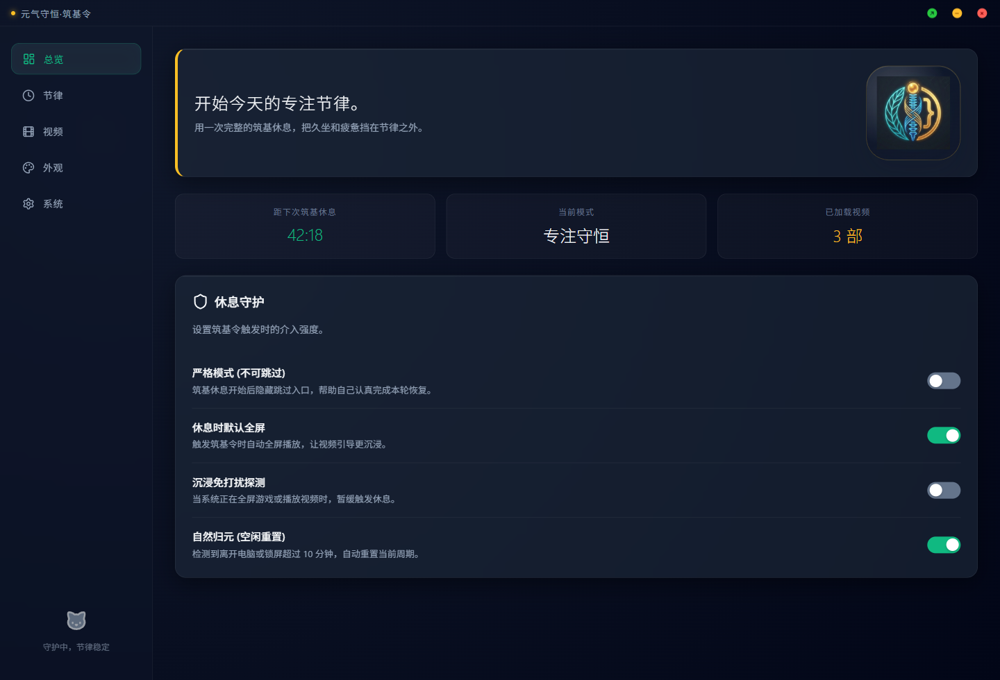
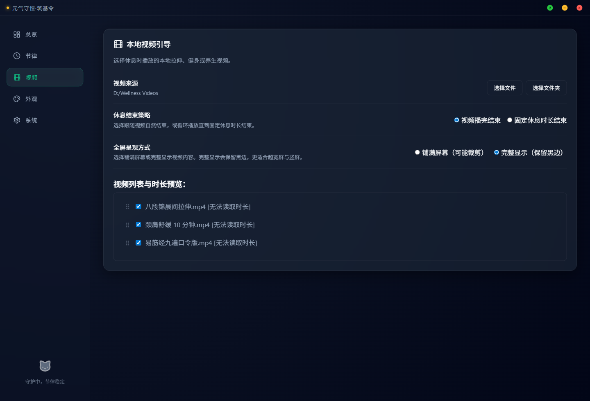
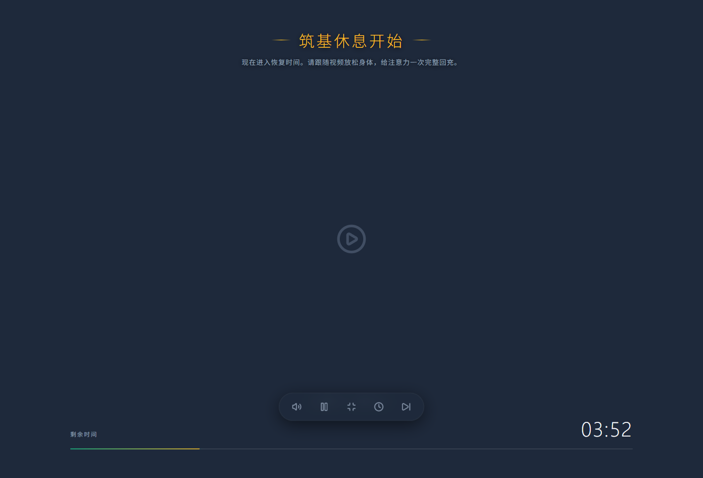

# Vitality Keeper

Vitality Keeper is a lightweight desktop break reminder built with Rust and Tauri. It stays quietly in the system tray, opens a focused break window when it is time to recover, and plays your local stretching, fitness, or wellness videos so the break is easier to complete.

[中文说明](./README.md)

## Why It Exists

Many break reminders are easy to dismiss. Vitality Keeper is designed to be calm but firm: it runs in the background, starts a full break flow at the right time, and helps you step away from long sitting sessions with local video guidance.

## Features

- Local video guidance: choose a single video or a folder of videos.
- Multi-display sync: break windows on different monitors share playback, mute, pause, and fullscreen state.
- Flexible finish strategy: end when the video ends, or loop until the configured break duration is reached.
- Fullscreen fit modes: fill the screen or preserve the full video frame with letterboxing.
- System tray controls: open the dashboard, start a break, skip the current break, or postpone it.
- Postpone limit: each break flow can be postponed at most three times.
- Launch at startup: keep the app running automatically after system boot.
- Bilingual UI: Simplified Chinese by default, with English available.

## Screenshots

> These screenshots are synchronized with the `v0.1.7` release.







## Download

The current public release focuses on Windows:

- `vitality-keeper_0.1.7_x64-setup.exe`
- `vitality-keeper_0.1.7_x64_en-US.msi`

Download the latest release from [GitHub Releases](https://github.com/qingmiao-tech/vitality-keeper/releases).

macOS and Linux are currently source-build targets. Prebuilt packages for those platforms are planned after packaging validation.

## Run From Source

Prerequisites:

- Node.js 18+
- Rust stable
- On Windows, Visual Studio Build Tools with the MSVC toolchain

```bash
npm install
npm run dev
```

On Windows, you can also run:

```bat
dev.bat
```

## Build

```bash
npm run build
```

If you also need signed updater assets and `latest.json` for GitHub-based auto-updates, run:

```bash
npm run build:release
```

Windows bundles are generated under:

```text
src-tauri/target/release/bundle/
```

For Linux, see:

```bash
./build-linux.sh
```

## Project Layout

```text
.
├── src/              # Dashboard, break page, and frontend config bridge
├── src-tauri/        # Rust backend, tray, window management, and packaging
├── docs/             # Architecture, product review, and release notes
├── README.md         # Chinese README
└── README.en.md      # English README
```

## Product Tone

The Chinese name keeps a memorable wellness metaphor, while the product itself stays practical: a local-first, lightweight, customizable break reminder for people who spend long hours at the computer.

## Contributing

Issues and pull requests are welcome. Good areas to help with:

- macOS and Linux packaging validation
- More reliable DND and global shortcut support
- Additional translations
- Accessibility and keyboard interaction improvements
- Better default guidance for public wellness video workflows

## License

Vitality Keeper is open source under the [MIT License](./LICENSE).
